<div align="center">

  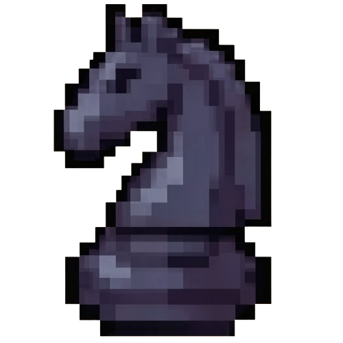

  **Chess Game - OOP Academic Project**

  A classic chess experience brought to the desktop. Manage matches, perform special moves, and master the board with an intuitive graphical interface.

  🌍 *Now featuring full dynamic language switching (English/Spanish)*
  
  [🇪🇸 Leer en Español](README.es.md)

  <br />

  
  
  

  <br />

  [Features](#-features) · [Architecture](#-system-architecture) · [Quick Start](#-quick-start) · [Demo](#-demo)

</div>

<br />

---

<br />

## ♟️ About the Project

This is a project developed for the **Object-Oriented Programming** course. It consists of a fully functional chess game built with **Java**.

This project was developed using software design patterns (such as MVC, Singleton, and Factory). From standard moves to complex logic like **castling**, **pawn promotion**, and **en passant**, everything is integrated into a visual interface (GUI) built on **Java Swing**.

<br />

## ✨ Features

<table>
<tr>
<td width="50%">

### ⚔️ Classic Gameplay
- **Strict validation** of legal moves for each piece.
- Full support for **castling** (kingside and queenside).
- Special rules: **En passant** capture and **pawn promotion**.
- Accurate **Check** and **Checkmate** detection algorithm.

</td>
<td width="50%">

### 💾 Match Management
- **Save and load** system (state persistence).
- Strategic options: declare a **tie** or **surrender**.
- Side panel with a log of **captured pieces**.
- Graphical interface with smart square highlighting.
- 🌍 **Dynamic Language Switching**: Instantly switch the interface between English and Spanish during gameplay.

</td>
</tr>
</table>

<br />

---

<br />

## 🏗️ System Architecture

The project follows an adapted **Model-View-Controller (MVC)** architecture, separating the heavy game logic from the user interface rendering.

```text
IC-2101-Proyecto-2/
│
├── Ajedrez3/Ajedrez/
│   ├── src/main/java/ajedrez/
│   │   ├── control/                  # Control and validation logic
│   │   │   ├── Control.java          # Main controller
│   │   │   └── DataVerificator.java  # Utilities
│   │   │
│   │   ├── interfaz/                 # Views (Java Swing)
│   │   │   ├── Ajedrez.java          # Main board window
│   │   │   ├── LoadMatch.java        # Load menu
│   │   │   └── SaveMatch.java        # Save menu
│   │   │
│   │   └── logica/                   # Model (Rules and pieces)
│   │       ├── Tablero.java          # Board state management
│   │       ├── Piece.java            # Base class for pieces
│   │       └── PieceFactory.java     # Piece creator
│   │
│   ├── src/main/resources/           # Assets (Images, icons)
│   └── pom.xml                       # Dependencies (Maven)
└── assets/                            # Demos and documentation
```

<br />

### 🧩 Implemented Design Patterns

| Pattern | Description and Usage |
|:---|:---|
| **Singleton** | Used in the `Control` and `Idioma` classes to ensure only a single global instance coordinates the match and the language state. |
| **Factory Method** | Implemented in `PieceFactory` to delegate and centralize the creation of different pieces (King, Queen, Pawn, etc.) based on their type. |
| **MVC** | Separation of concerns between the Swing views (`interfaz`), business rules (`logica`), and the mediator (`control`). |

<br />

---

<br />

## 🚀 Quick Start

### Prerequisites

To compile and run this project, you need:

| Software | Recommended Version |
|:---|:---|
| [Java JDK](https://adoptium.net/) | `v17` or higher |
| [Apache Maven](https://maven.apache.org/) | `v3.6` or higher |

<br />

<details>
<summary><strong>📦 1. Compile from source</strong></summary>

<br />

To compile the project and package it into a portable executable, open a terminal in the directory where `pom.xml` is located:

```bash
cd Ajedrez3/Ajedrez
mvn clean package
```

This will download the necessary dependencies and generate the `Ajedrez-1.0-SNAPSHOT-jar-with-dependencies.jar` file in the `target/` folder.

</details>

<details>
<summary><strong>🎮 2. Run the compiled version (JAR)</strong></summary>

<br />

Once the project is packaged, you can run the `.jar` file directly. This will open the splash screen followed by the full game.

```bash
cd Ajedrez3/Ajedrez/target
java -jar Ajedrez-1.0-SNAPSHOT-jar-with-dependencies.jar
```
*(💡 On Windows environments, you can also simply double-click the `.jar` file)*

</details>

<br />

---

<br />

## 📸 Demo

Here is a look at the game's main loading screen:

<div align="center">
  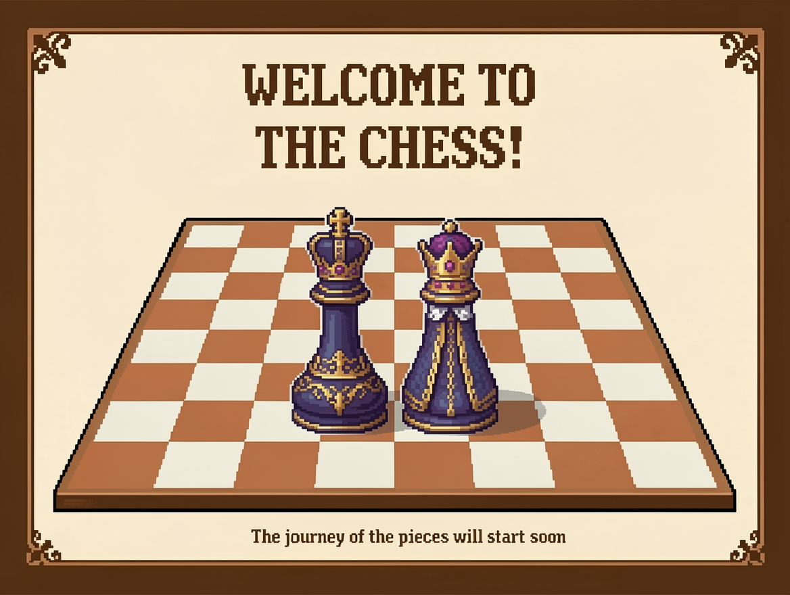
</div>

<br />

### Home Screen
<div align="center">
  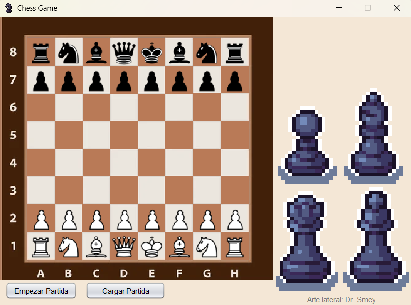
</div>

<br />

### Special Moves and Rules

**Kingside and Queenside Castling**  
To castle, you must first click the **King** and then click the **Rook** you want to castle with. The game will calculate if the path is clear and if the conditions are met to perform the move automatically.
<div align="center">
  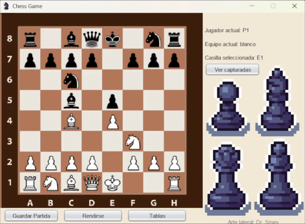
  <br/><br/>
  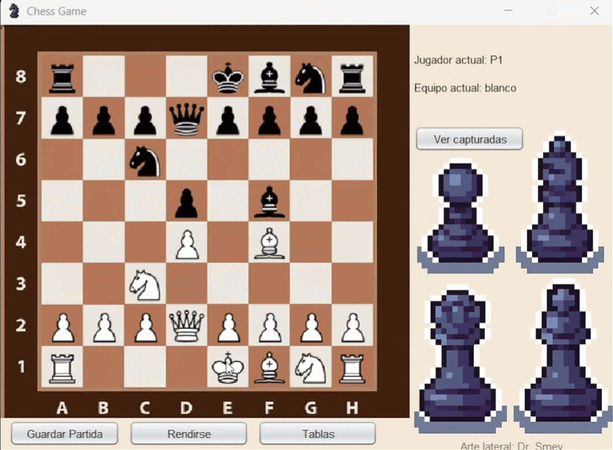
</div>

<br />

**En Passant Capture**  
<div align="center">
  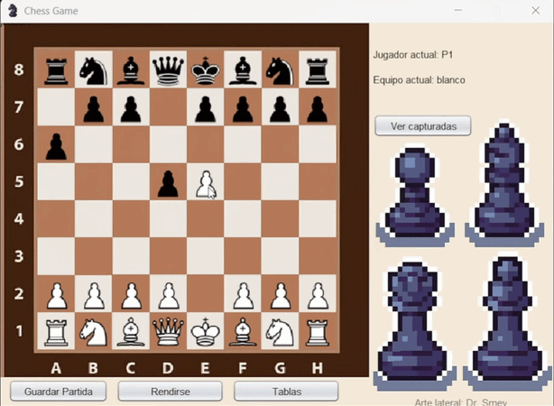
</div>

<br />

**Pawn Promotion**  
When a pawn reaches the opposite end of the board, a menu is displayed allowing the player to choose to promote it to a Queen, Rook, Knight, or Bishop.
<div align="center">
  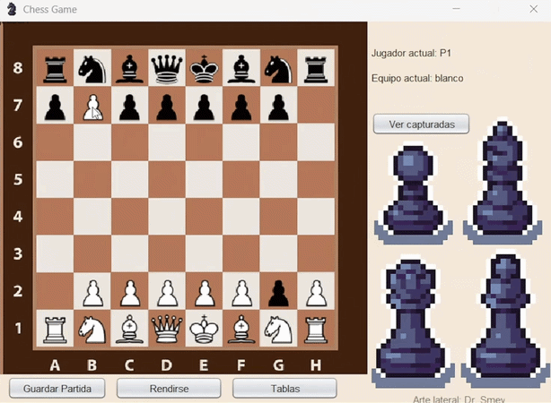
</div>

<br />

### Check and Checkmate

**Check**  
The game's validation system prevents you from making moves that expose your own King ("suicidal" moves). If you are in check, the game will not allow you to advance until you make a valid move that defends the King.
<div align="center">
  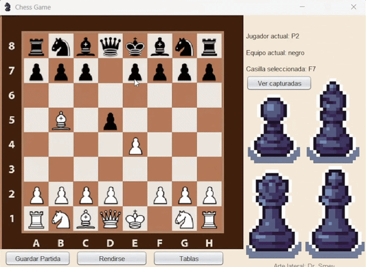
</div>

<br />

**Checkmate**  
<div align="center">
  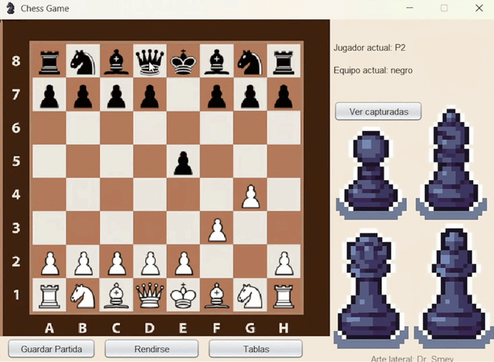
</div>

<br />

### Match Management

**Saving and Loading Matches**  
When saving a match, a file selector will open. It is **very important** to select the desired path and manually add the `.bin` extension at the end of the name (e.g., `match_01.bin`) to ensure the file is saved and can be loaded correctly.

**Save Match**  
<div align="center">
  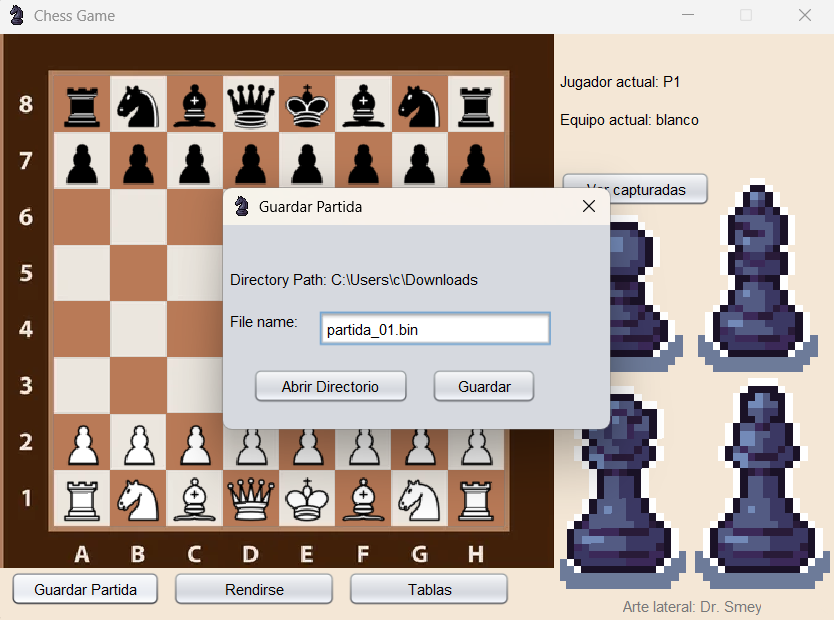
</div>

<br />

**Load Match**
<div align="center">
  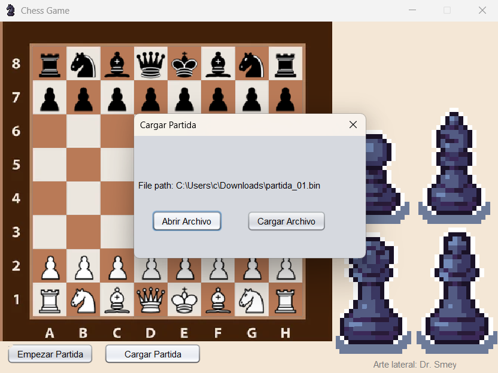
</div>

<br />

**Tie and Surrender**  

**Tie**  
<div align="center">
  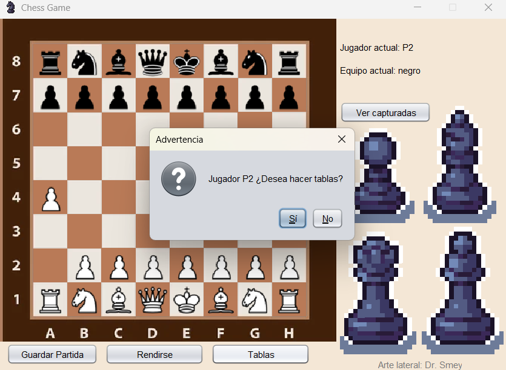
</div>

<br />

**Surrender**
<div align="center">
  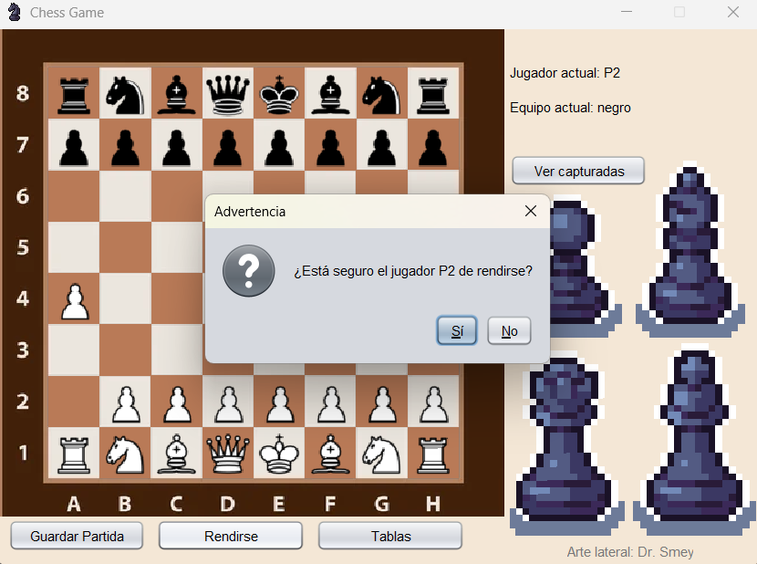
</div>

### Tracking and Utilities

**Captured Pieces Panel**  
<div align="center">
  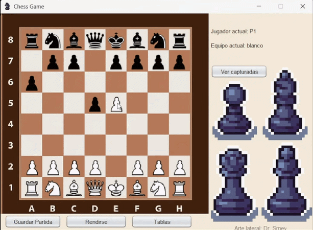
</div>

---

<br />

## 📄 License and Credits

This project is distributed under the **MIT** license. Developed by **Daniel Alemán** and **Luis Meza** as an academic project for the **Object-Oriented Programming (OOP)** course at the **Instituto Tecnológico de Costa Rica (TEC)**.
